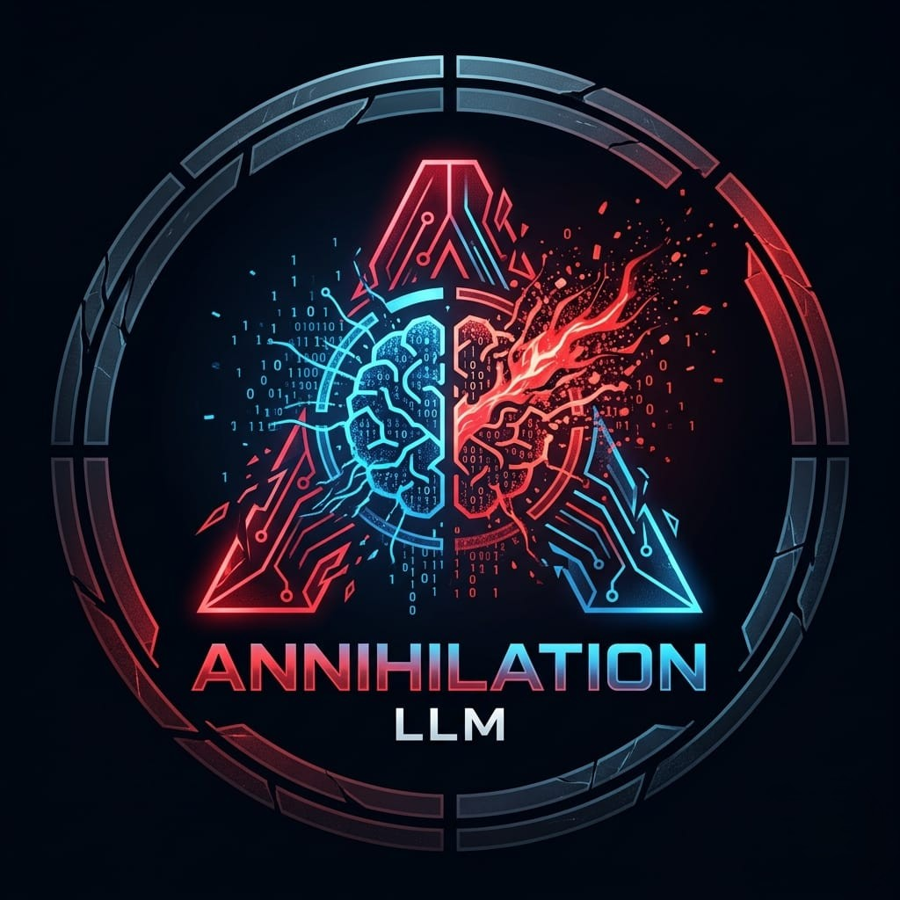
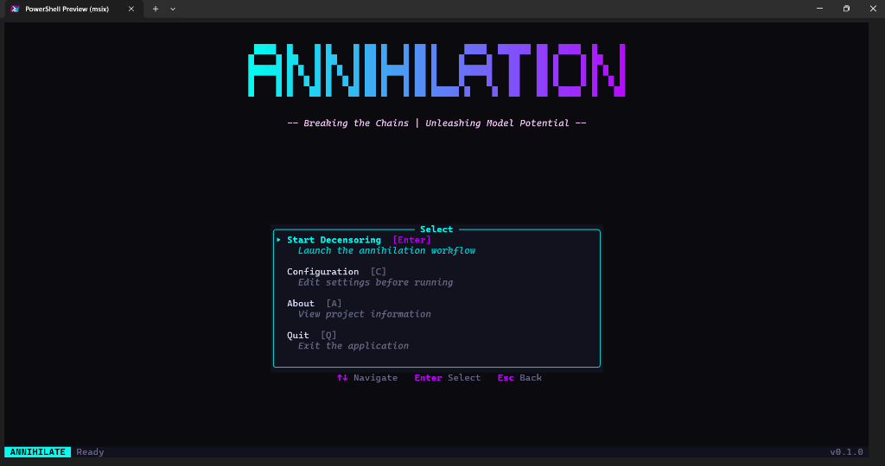
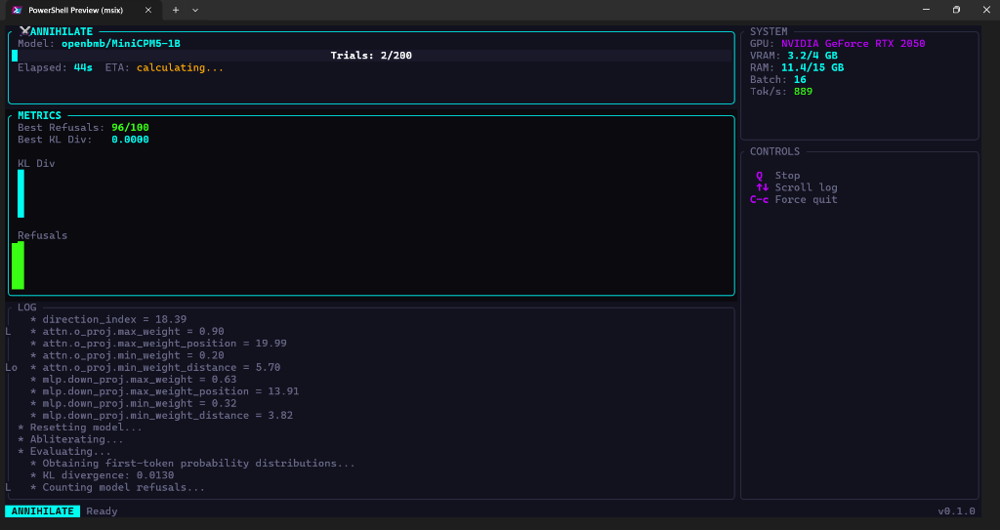

# ⚔️ Annihilation

<div align="center">
  
</div>

**Autonomous Language Model Decensoring Framework**

[](LICENSE)
[](https://www.python.org/)
[](https://pytorch.org/)

---

> ⚠️ **Note:** Windows is fully supported out of the box. Linux support is currently **under active development** and you may encounter bugs or require manual environment setup (like installing correct GPU drivers).

## 🔥 What is Annihilation?

**Annihilation** is a fully automatic framework designed to remove censorship (safety alignment) from transformer-based language models. By using advanced parametric directional ablation and TPE-based optimization, it autonomously finds the absolute best parameters to decensor your models without requiring any expensive post-training.

### Key Features
- 🤖 **Fully Autonomous**: No human intervention required.
- 🖥️ **Terminal UI**: A beautiful, real-time dashboard built in Rust.
- ⚡ **Zero-Shot Decensoring**: Removes refusals while preserving the model's core capabilities.
- 🎯 **Broad Compatibility**: Works with dense models, MoE, hybrid, and multimodal architectures.

---

## 🖥️ The Annihilation TUI

Annihilation features a high-performance **Rust Terminal User Interface (TUI)** that manages the entire workflow for you.

### Splash Screen & Setup
Easily configure your optimization preset and select models. You can even resume interrupted runs using the built-in Checkpoint System!
<div align="center">
  
</div>

### Live Processing Dashboard
Once running, monitor everything in real-time. The dashboard features dynamic sparkline charts for KL Divergence and Refusals, hardware monitoring, and color-coded live logs.
<div align="center">
  
</div>

---

## ⚠️ Direct CLI Usage (Fallback)

> ⚠️ **NOTICE:** The Rust TUI is currently undergoing a major rewrite to fix freezing bugs on Windows and Linux and is **temporarily broken**. Please use the direct Python CLI in the meantime!

If you want to bypass the TUI entirely and use the core Python CLI, you can run it directly from the virtual environment:

For **Windows** (PowerShell):
```powershell
.\.venv\Scripts\python.exe -m annihilate --help
# Example:
.\.venv\Scripts\python.exe -m annihilate --model openbmb/MiniCPM5-1B --n-trials 200
```

For **Linux / WSL** (Bash):
```bash
./.venv/bin/python -m annihilate --help
# Example:
./.venv/bin/python -m annihilate --model openbmb/MiniCPM5-1B --n-trials 200
```

---

## 🚀 Quick Start

Ensure you have **Python 3.10+** and **Rust** installed, and that your PyTorch installation supports CUDA (if you are using an NVIDIA GPU).

### Setup & Launch
> ✅ **Note:** Windows and Ubuntu (Linux/WSL) are fully supported!

For **Windows** (PowerShell):
```powershell
git clone https://github.com/tjcrims0nx/annihilation-llm.git
cd annihilation-llm
.\start.bat
```

For **Ubuntu / Linux**:
> ⚠️ **CRITICAL:** Do not use `apt install rustc`. You MUST install the latest secure version of Rust via `rustup` to support modern Rust 2024 features. Run: `curl --proto '=https' --tlsv1.2 -sSf https://sh.rustup.rs | sh`

```bash
git clone https://github.com/tjcrims0nx/annihilation-llm.git
cd annihilation-llm
chmod +x start.sh
./start.sh
```

> 💡 **Note:** The very first time you run this, it will take a minute to compile the Rust TUI and set up the Python virtual environment. Subsequent launches will be near-instant! You do **not** need to manually build the project; the `start.bat` script handles all compilation and environment setup on the fly.

---

## 📜 License & Disclaimer

**Annihilation** is distributed under the **GNU Affero General Public License v3**. See [LICENSE](LICENSE) for details.

> ⚡ **Disclaimer**: This tool is provided for **research and educational purposes** only. We do not condone the use of decensored models for harmful activities. Users are entirely responsible for ensuring their compliance with applicable laws and Terms of Service.

<div align="center">
**Breaking the Chains | Unleashing Model Potential**
</div>
