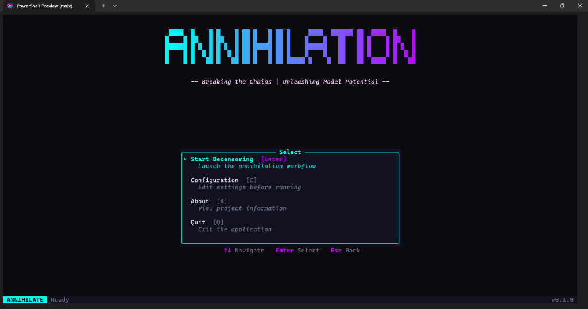
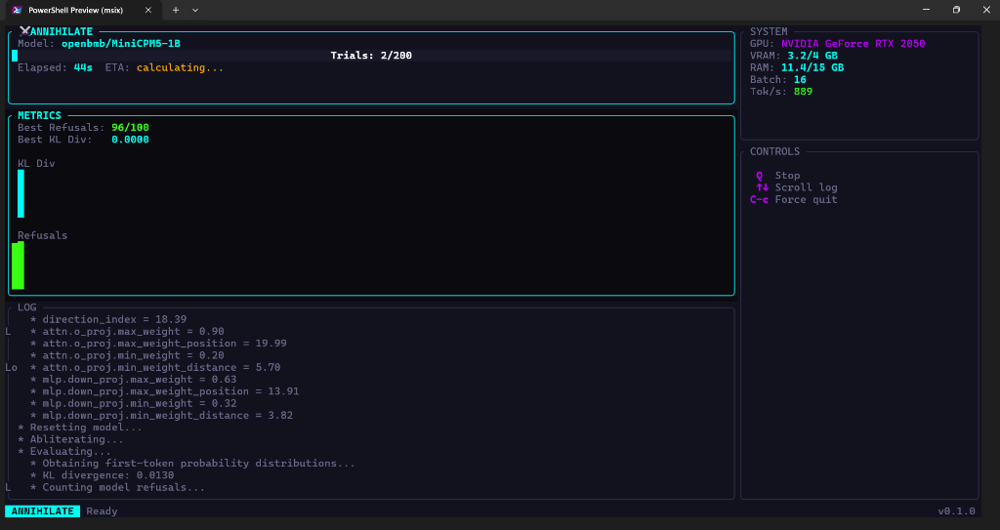

# ⚔️ Annihilation

<div align="center">
  
</div>

**Autonomous Language Model Decensoring Framework**

[](LICENSE)
[](https://www.python.org/)
[](https://pytorch.org/)

---

## 🔥 What is Annihilation?

**Annihilation** is a fully automatic framework designed to remove censorship (safety alignment) from transformer-based language models. By using advanced parametric directional ablation and TPE-based optimization, it autonomously finds the absolute best parameters to decensor your models without requiring any expensive post-training.

### Key Features
- 🤖 **Fully Autonomous**: No human intervention required.
- 🖥️ **Terminal UI**: A beautiful, real-time dashboard built in Rust.
- ⚡ **Zero-Shot Decensoring**: Removes refusals while preserving the model's core capabilities.
- 🌌 **OBLITERATUS Integration**: Advanced experimental algorithms (COSMIC Layer Selection, Gaussian-shaped ablation kernels, and Expert-Granular Abliteration) integrated directly from OBLITERATUS.
- 🎯 **Broad Transformer Compatibility**: Supports transformer-based dense, MoE, hybrid, and multimodal architectures, including pre-quantized `compressed-tensors`/FP8 checkpoints. Less-tested model families may require architecture-specific tensor targeting and output-quality validation.
- 🔍 **Automatic Format Detection**: Reads a model's config before downloading any weights, so an unsupported architecture, a missing quantization backend, or a repository that executes its own code is reported by name up front rather than failing minutes into a load.
- 📦 **Pre-Quantized Models**: Loads models that already ship quantized — including `compressed-tensors`/FP8, GPTQ, AWQ, and bitsandbytes — provided the corresponding backend package is installed. Abliteration itself is format-agnostic.
- 📊 **Benchmark the Annihilated Model**: Rebuilds the best trial straight from the checkpoint and scores it with the `lm-eval` harness, so you can measure what the abliteration cost in raw capability without re-running the study.
- 💾 **GGUF Export**: Converts the annihilated model to GGUF (`Q4_K_M`, `Q8_0`, or unquantized F16) for llama.cpp, Ollama, and LM Studio. The llama.cpp toolchain is fetched and checksum-verified on demand — no manual export step in between.

---

## 🔍 Model Format Detection

Before any weights are fetched, Annihilation inspects the model's `config.json` and reports what it found:

```
* Detected LlamaForCausalLM
* Pre-quantized model: compressed-tensors
```

Both lines appear in the TUI log, and the architecture and quantization method are shown in the dashboard's **SYSTEM** panel, so you can confirm the right model loaded before committing to a long run.

This step exists to fail early and legibly:

- **Missing quantization backend** → an error naming the exact package to `pip install`, instead of a stack trace from deep inside the loading code.
- **Custom architecture code** → a warning that loading the model executes code from its repository. Pass `--trust-remote-code` once you have reviewed it.
- **Already-quantized model** → `--quantization bnb_4bit` is ignored rather than stacked on top of the model's own quantization.

> 💡 **Note on exporting:** merging LoRA adapters into a pre-quantized model dequantizes the targeted layers, so the exported weights are full precision and larger than the original repository. Export as an adapter instead to keep the quantized base.

---

## 🖥️ The Annihilation TUI

Annihilation features a high-performance **Rust Terminal User Interface (TUI)** that manages the entire workflow for you.

### Splash Screen & Setup
Easily configure your optimization preset and select models. You can even resume interrupted runs using the built-in Checkpoint System!
<div align="center">
  
</div>

### Live Processing Dashboard
Once running, monitor everything in real-time. The dashboard features dynamic sparkline charts for KL Divergence and Refusals, hardware monitoring, and color-coded live logs.
<div align="center">
  
</div>

---

## 🌌 OBLITERATUS Advanced Options

You can now toggle experimental algorithms directly from the TUI configuration menu by selecting **OBLITERATUS Advanced**. This enables:

- **COSMIC Layer Selection**: Instead of blindly searching across the entire network, the system analyzes cosine similarities between harmless and harmful residual streams. It automatically anchors the optimization process around the mathematically proven optimal layer, massively reducing the search space.
- **Expert-Granular Abliteration (EGA)**: For Mixture-of-Experts (MoE) models, EGA scores each expert's weight matrix against the target refusal direction. Instead of applying a flat penalty, experts holding high concentrations of refusal vectors take the full intervention, while experts no better aligned than chance are scaled down to roughly a third of it. The score is measured relative to chance alignment, so it means the same thing at any hidden size.
- **Gaussian-shaped Ablation Kernels**: Replaces traditional rigid interpolation bounds with a smooth, bell-shaped Gaussian curve to distribute weight changes across adjacent layers. This results in smoother vector blending and better text coherence post-ablation.

---

## 📊 Benchmarking the Annihilated Model

Abliteration is a trade: refusals go down, and capability may go with them. Annihilation can score the finished model so that trade is measured rather than assumed.

Reach it from the TUI via **Completed Models** (`M`) → pick a model → **Run Benchmarks** (`B`), or from the same actions menu right after a run finishes.

What happens on that keypress:

1. The best trial is read out of `checkpoints/<model>.jsonl` — fewest refusals, ties broken by lowest KL divergence.
2. It is rebuilt under the settings the study actually ran with, including the pinned `model_commit` revision. Reconstructing a trial under different settings silently produces a *different* model, so the original settings are reused rather than re-derived.
3. Refusal directions are recomputed, the trial's abliteration parameters are applied, and the result is handed to `lm-eval`'s `HFLM` wrapper with automatic batch sizing.
4. Every metric streams into the **Benchmark Dashboard** as it lands, alongside the live process log.

The default tasks are `hellaswag` and `arc_easy`. Any `lm-eval` task works when driving the script directly:

```powershell
.\annihilation-env\Scripts\python.exe -u scripts/run_benchmarks.py openbmb/MiniCPM5-1B mmlu,gsm8k
```

The harness ships with the engine, so there is nothing extra to install. Nothing is written to disk either — the model is reconstructed in memory, so benchmarking never leaves an export behind. A completed run is required: with no checkpoint for that model, it stops with `No checkpoint found ... Run annihilation first.`

---

## 💾 GGUF Export

From the TUI: **Convert to GGUF** (`G`), then choose how hard to quantize.

| Option | Trade-off |
| --- | --- |
| `Q4_K_M` | Good balance of quality and size (recommended) |
| `Q8_0` | Near-perfect quality, larger file |
| `F16` | Unquantized, maximum quality |

The result lands in `exports/<model>-<quant>.gguf`. The TUI confirms the file actually exists once the converter exits — a zero exit code on its own is not proof of an artifact.

Conversion runs in two stages, matching llama.cpp's own pipeline:

1. `convert_hf_to_gguf.py` writes an F16 GGUF intermediate next to the target.
2. `llama-quantize` compresses that to the requested type, then the intermediate is deleted. Choosing F16 skips this stage and just keeps the intermediate.

**Straight off a finished study.** Point it at a model *name* rather than a directory and the annihilated model is reconstructed from the checkpoint exactly as the benchmark path does — best trial, original settings — merged, written to a scratch folder, converted, and the scratch folder is removed. No separate "export merged model" step is needed first:

```powershell
.\annihilation-env\Scripts\python.exe scripts/gguf_converter.py --model-path openbmb/MiniCPM5-1B --quant-type Q4_K_M --output exports/minicpm5-Q4_K_M.gguf
```

**On the llama.cpp toolchain.** It is downloaded on first use, not vendored. Prebuilt Windows binaries come from the latest [`ggml-org/llama.cpp`](https://github.com/ggml-org/llama.cpp) release, and the matching source archive is pinned to that same release tag instead of tracking `master`. Because both are *executed*, they are treated as code: downloads are restricted to HTTPS, the SHA-256 is verified against GitHub's published asset digest, and archive members that would escape the extraction directory are rejected outright. Pin your own digests with `LLAMA_CPP_BIN_SHA256` and `LLAMA_CPP_SRC_SHA256`.

> 💡 **Note:** automatic binary download is currently Windows-only. On Linux and macOS, place a `llama-quantize` binary under `scripts/llama_cpp_bin/` yourself; the conversion script is still fetched automatically.

---

## ⚠️ Direct CLI Usage (Advanced)

If you want to bypass the TUI entirely and use the core Python CLI, you can run it directly from the virtual environment:

```powershell
.\annihilation-env\Scripts\python.exe -m annihilate --help
# Example:
.\annihilation-env\Scripts\python.exe -m annihilate --model openbmb/MiniCPM5-1B --n-trials 200
# Check the installed engine version:
.\annihilation-env\Scripts\python.exe -m annihilate --version
```

---

## 🚀 Quick Start

Ensure you have **Python 3.10+** and **Rust** installed, and that your PyTorch installation supports CUDA (if you are using an NVIDIA GPU).

### Setup & Launch

The TUI is the Rust front-end; the abliteration engine ships as the [`annihilate-llm`](https://pypi.org/project/annihilate-llm/) package on PyPI. Install the engine into a virtual environment at the repository root, then launch the TUI:

```powershell
git clone https://github.com/tjcrims0nx/annihilation-llm.git
cd annihilation-llm

# Create the environment the TUI looks for and install the engine into it
uv venv annihilation-env
uv pip install --python annihilation-env annihilate-llm

.\start.bat
```

The TUI locates the interpreter by checking `annihilation-env`, `.venv`, `venv`, and `env` at the repository root, in that order — any of those names works. The order matters when more than one exists, which is common: `uv` creates `.venv` by default, so a repository with both directories uses `annihilation-env`.

> 💡 **Note:** `start.bat` compiles the Rust TUI, so the very first launch takes a minute. Subsequent launches are near-instant. It does **not** create the Python environment — do that once, as above.

---

## 📜 License & Disclaimer

**Annihilation** is distributed under the **GNU Affero General Public License v3**. See [LICENSE](LICENSE) for details.

> ⚡ **Disclaimer**: This tool is provided for **research and educational purposes** only. We do not condone the use of decensored models for harmful activities. Users are entirely responsible for ensuring their compliance with applicable laws and Terms of Service.

<div align="center">
**Breaking the Chains | Unleashing Model Potential**
</div>
